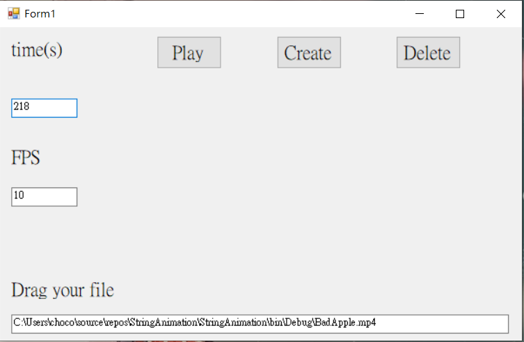

# StringAnimation
It will extract frames from your video with FFMPEG,\
subsequently convert all images to txts depending on
each pixel's grayscale,and finally print all of them frame by frame.

## Usage

* [Download FFMPEG](https://ffmpeg.org/) and set it environment variable
* Drag your video file to exe and choose preferred time and fps.

## Demo.mp4

